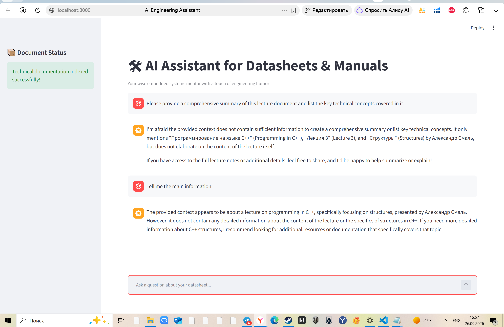

# 🛠 AI Assistant for Datasheets & Manuals

An advanced RAG (Retrieval-Augmented Generation) system built with Streamlit and LangChain designed for hardware engineers, embedded systems developers, and electronics professionals. The assistant indexes PDF technical documentation (datasheets, reference manuals) and provides intelligent, context-aware answers with a touch of engineering humor.

## 🚀 Features
- Smart RAG Pipeline: Uses OpenAI Embeddings and Chroma DB to retrieve precise contexts from multi-page PDFs.
- Interactive UI: Clean, ChatGPT-like conversational web interface built on Streamlit.
- Embedded Expertise: System prompt optimized to act as a Senior Embedded Systems Engineer.
- Secure Configuration: Complete separation of code and API credentials using environment variables.

## 📸 Interface Demonstration
*Here you can insert a screenshot of your working chat!*

## 🛠 Project Structure
- app.py: Main application file containing the UI and LangChain pipeline logic.
- .env: (Local only) Secure storage for OpenAI API credentials.
- data/: Directory for input technical PDF documents.
- vector_db/: Persistent local directory for indexed vector embeddings.

## ⚙️ Installation & Setup

1. Clone the repository:
  
   git clone https://github.com
   cd AI-Data-Sheet-Assistant
   
2. Install dependencies:
  
   pip install streamlit langchain-openai langchain-community chromadb pypdf python-dotenv
   
3. Configure Environment Variables:
   Create a .env file in the root directory and add your secret key:
  
   OPENAI_API_KEY=your_openai_api_key_here
   
4. Run the Application:
  
   python -m streamlit run app.py --global.developmentMode=false --server.port 3000

GitHub (https://github.com/)
GitHub · Change is constant. GitHub keeps you ahead.
Join the world's most widely adopted, AI-powered developer platform where millions of developers, businesses, and the largest open source community build software that advances humanity.
